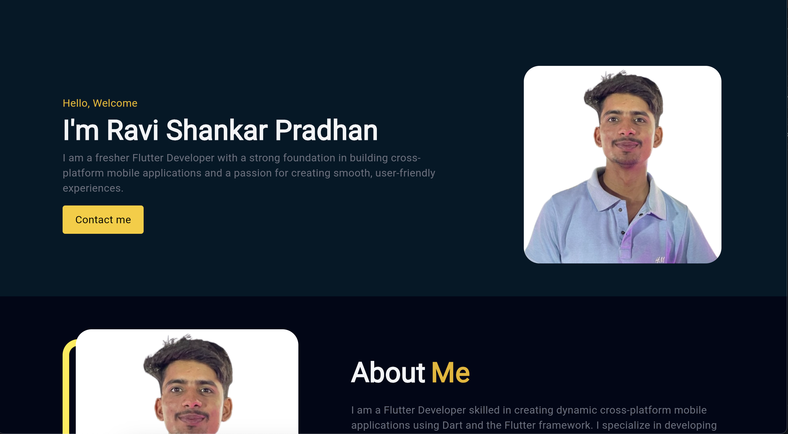
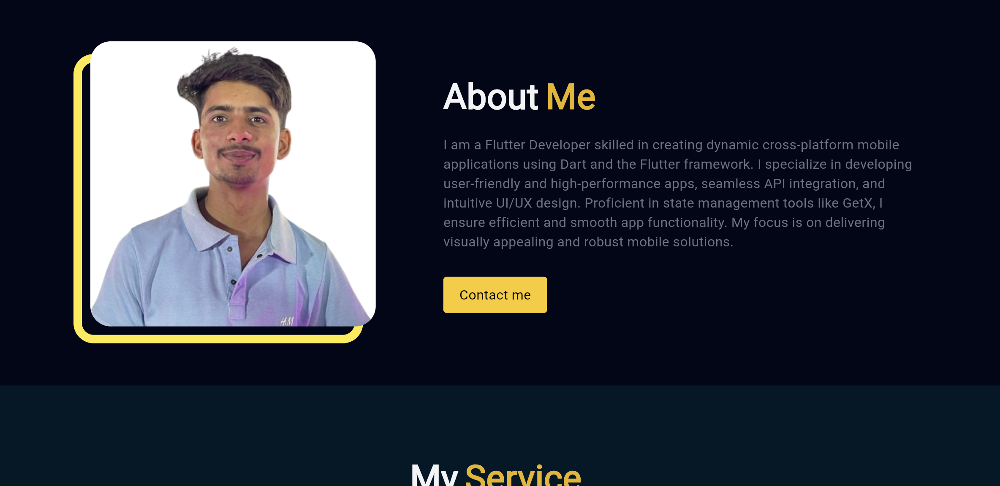
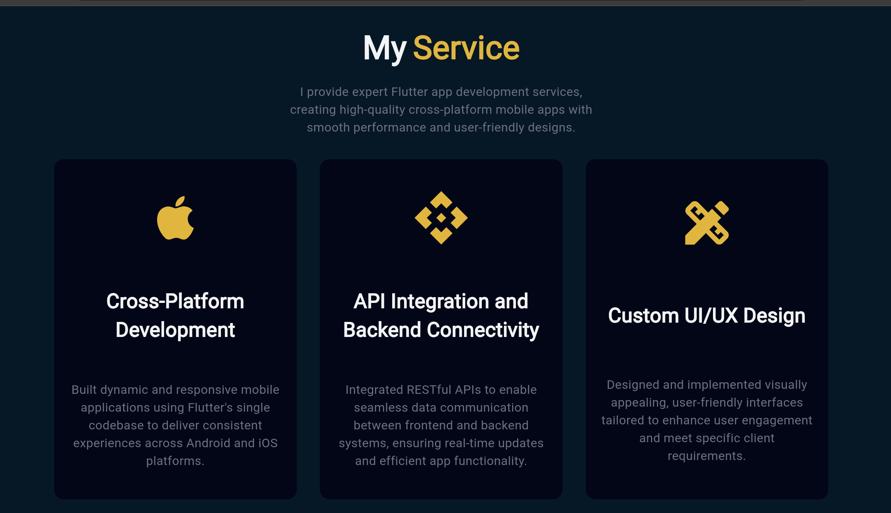

# My Portfolio App

This is a simple Flutter application designed for Chatting.

## Getting Started

- User-Friendly Interface: Design an intuitive and visually appealing UI that showcases your projects and skills clearly, making it easy for visitors to navigate and explore your work.
- Responsive Design: Ensure that the portfolio is fully responsive, providing a seamless experience on devices of all sizes, from desktops to smartphones.
- Project Showcases: Highlight individual projects with detailed descriptions, technologies used, and links to live demos or repositories. This will help potential employers or clients understand your capabilities.
- Contact and Social Links: Include a contact form and links to your social media profiles (like LinkedIn, GitHub, etc.) to facilitate networking and communication with potential collaborators or employers.

## App Screenshot

Here are the screenshots of the app:

